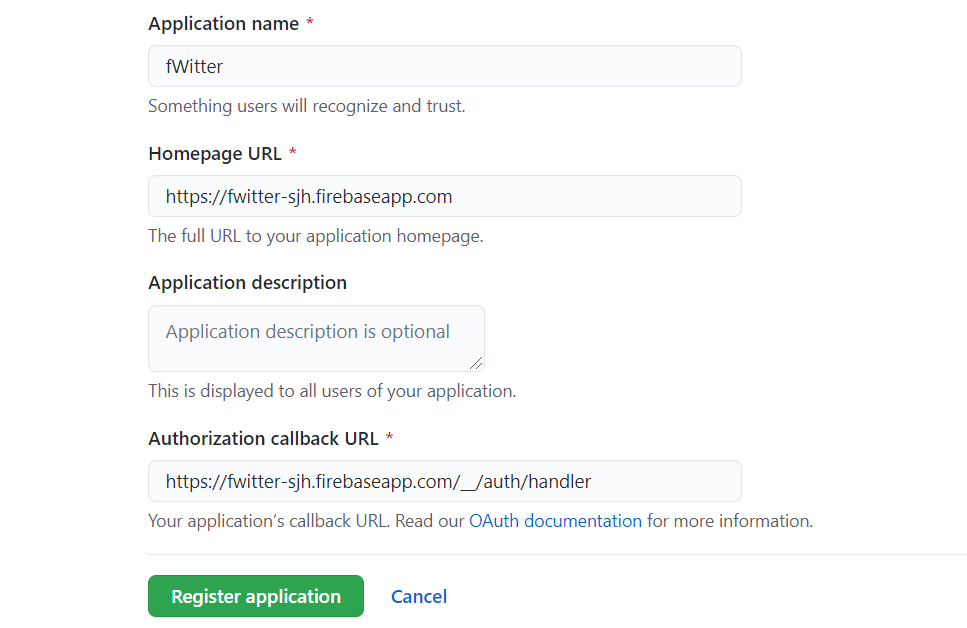

https://nomadcoders.co/nwitter/lectures/1905

@@@@@@@@@@@chapter 1 @@@@@@@@@@@
RCA에서 필요없는파일 정리
깃헙연동 --> firebase 생성

1. cdn 이용한 방법 2. node 이용한방법
   node이용 npm install --save firebase

firebase.js 파일에 설정때려넣고 환경변수들 .env로 돌린뒤에
process.env.##로 환경변수에 접근가능하다

initializeApp 초기화함수 때려줌
그후에 firebase객체들을 export해서 외부에서도 사용할수있다

절대경로의 root 설정하는법 (..경로 쓰지않고) jsconfig.js 파일에

```
{
    "compilerOptions": {
      "baseUrl": "src"
    },
    "include": ["src"]
  }
```

firebase를 초기화하고
firebase.auth().currentUser는 지금 유저 또는 null을 반환한다

// github Oauth firebase 연동하기

@@@@@@@@@@@chapter 2 @@@@@@@@@@@
firebase Authentication에서 sign-in method에서 깃헙 활성화후
깃헙 setting --> developer setting --> OAuth 설정 -->

id와 비밀번호를 firebase client app에 설정

authService.createUserWithEmailAndPassword 혹은 이메일로 로그인할시에
currentUser가 null이 아니라 로그인된 유저가 나오겠죠?
근데 currentUser의 변화를 listensing 무언가를 설정해놓아야하고
onAuthStateChanged 로 리스닝

// popup으로 구글/깃헙 Oauth 사용하기 (Authentication template으로 이메일 확인/변경 등등도 서비스함)
firebase.auth 로부터 google provider를 받아서
authService의 signinWithPopup 메소드에 방금 provider를 넣어서 실행
그러면 service.currentUser.displayName 에서 내이름 '시하'가 나온다
Oauth에서 에러나면 --> 세션/스토리지 삭제 or firebase 재시작 or 브라우저 새로켜기

// state바꾸고 나서 새로운 화면 redirect하는 2방법
1 redirect 컴포넌트를 Route마지막에 둬서 from \* to '/'로 루트로 가게한다
2 useHistory() 에서 특정행동에 history.push("/") 주소추가해준다

@@@@@@@@@@@chapter 3 @@@@@@@@@@@
//트윗을 위한 db 만들기 firebase cloudfilrestore 에서 db만든다
document == db // collection == table

트윗 add dbService.collection("fweet").add({...})
트윗 read dbService.collection("fweet").get().forEacth(d=>console.log(d.data))
트윗 read 스냅샷이용
dbService.collection("fweet").onSnapshot(callback)
callback은 snapshot을 인자로 받는데 snapshot.docs.map(doc => doc.data())
map/filter/forEach의 doc인자의 doc.data()가 정보를 가지고있다
리얼타임으로 자료가 계속바뀐다 리얼타임아닌 방법도 후에 소개

트윗 Delete dbService.doc(`fweet/${fweet.id}`).delete()

트윗 update dbService.doc(`fweet/${fweet.id}`).update({...})
@@@@@@@@@@@chapter 4 @@@@@@@@@@@
//트윗에 이미지 같이 넣기

const file = e.target.files[0]
const reader = new FileReader();

reader.onloadend = (finishedEvent) => {
console.log(finishedEvent.target.result);
};
reader.readAsDataURL(file);

readasDataURL은 오래걸리기때문에 이벤트리스너를 걸어서 나온 e.target.result에 아주 긴 문자열이 나오는데 브라우저는 이 문자열을 이미지로 변환할수있다

이미지태그에 src={reqult} 를 넣으면 브라우저가 텍스트->이미지 로 인식할수있다

이제 fireStorage를 사용하는데
const fileRef = storageService.ref().child(`${userObj.uid}/${uuidv4()}`) 로 내 스토리지의 레퍼런스를만들고

두번째로 포맷을적어준다(base64,base64url, raw .... )
const response = fileRef.putString(result, "data_url")

response로부터 firebase가 호스팅하는 url을 얻어낼수있다
const attachmentUrl = await response.ref.getDownloadURL();

그 url을 fweet의 새로운 필드에 creatorId처럼 추가해서 add()한다

// fweet지울때 storage에 있는 사진도 같이 지워주기
storageService.refFromURL(fweet.attachmentUrl).delete();

@@@@@@@@@@@chapter 5 @@@@@@@@@@@
profile 꾸미기
현재 유저가id에 맞는 fweet을 가져오는 쿼리문 만들기
const fweets = await dbService
.collection("fweet")
.where("creatorId", "==", userObj.uid)
.orderBy("createdAt")
.get();

updateProfile 함수로 displayName 과 photoURL을 수정할수있다

updateProfile은 onAuthStateChanged가 리스닝하지않기때문에 새로 Obj를 refresh하는 함수를 만든다

prop이 변경되었을때 object크기가 너무 크면 연산에 오래걸려서 바로 랜더가 안될수 있으므로 oject크기를 필요한것만 뽑아 따로 명시적으로 줄여준다

@@@@@@@@@@@chapter 6 @@@@@@@@@@@
css 갖다붙이고

"homepage": "https://JongHyeonSong.github.io/fwitter" packge.json 설정
"predeploy": "npm run build",
"deploy": "gh-pages -d build",

@@@@@@@@@@@chapter 7 @@@@@@@@@@@
// 보안관련 추가하기
jonghyeonsong.github.io firebase 도메인에 추가

//내 firebase를 나만(내 어플의 주소만) 사용하게 하기
https://console.developers.google.com/apis/credentials?hl=ko%3Fhl%3Dko&project=fwitter-sjh-d5dde

에서 사용자인증정보 --> browser Key -->

HTTP리퍼러(웹사이드) 클릭후에

제한할 웹사이트
https://jonghyeonsong.github.io/*
localhost
firebase도메인(fwitter-sjh-d5dde.firebaseapp.com) (authentication-->sign-in-method)
3가지넣어준다

@@@@@@@@@@@chapter 8 @@@@@@@@@@@

@@@@@@@@@@@chapter 9 @@@@@@@@@@@
